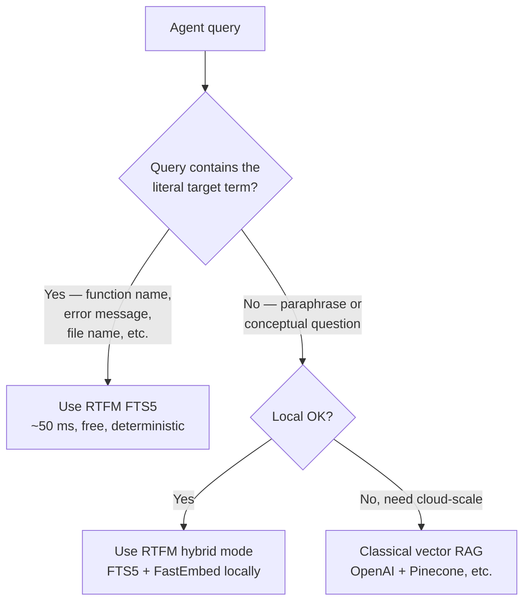

# RTFM vs Vector RAG

If you've shipped anything LLM-flavored in the last two years, your default
mental model for "agent retrieval" is probably **vector RAG**: chunk your
documents, embed them, store the vectors in a database, retrieve by cosine
similarity at query time.

RTFM does that too, optionally — but its default is **FTS5 full-text
search** running locally on a SQLite file. Why? Because for the actual
workload of AI coding agents, FTS5 is faster, cheaper, and surprisingly
often *more accurate*. This page explains when each approach wins.

## TL;DR

| | RTFM (FTS5 default) | Classical vector RAG |
|---|---|---|
| **Latency (cold)** | <50 ms | 2–6 min cold start (model download) |
| **Latency (warm)** | <50 ms | 50–500 ms |
| **Storage** | One SQLite file | Vector DB + index |
| **Cost** | $0 | Embedding API + vector DB |
| **Recall on exact terms** | High (porter stemming) | Medium (semantic drift) |
| **Recall on paraphrase** | Low without embeddings | High |
| **Setup** | `rtfm init` (zero deps) | API keys + vector DB + pipeline |
| **Run-anywhere** | Yes (pure Python) | No (cloud-bound) |
| **Inspectable** | `sqlite3 library.db` | Opaque vector store |
| **License** | MIT | Often proprietary |

**Use RTFM** when your queries contain the literal terms you're looking
for (function names, class names, error messages, API paths, citation
markers, file names, regulation references). This is *most agent
queries*.

**Use vector RAG** when your queries are paraphrases of the content
you're searching (semantic question answering, "find me docs *about* X
even if they don't say X"). RTFM supports this too — enable
[FastEmbed embeddings](../json-mappings.md#) — but it's not the default.

## Why FTS5 is the right default for code agents

Look at the queries an AI coding agent actually issues:

- `"AuthMiddleware class"`
- `"connect_to_database function"`
- `"PaymentError handling"`
- `"useCallback hook"`
- `"Article 39 decies A"` (legal corpus)
- `"chunks_fts schema"` (database introspection)
- `"OSBD process"` (research term)

Every single one is a **literal term query** — the thing the agent is
looking for is *named in the query*. FTS5 with porter stemming handles
these instantly. Cosine similarity over 384-dimensional vectors adds no
information, costs more, and drifts.

Embedding-based retrieval shines on a different shape of query —
"explain how authentication propagates through the request lifecycle"
— which agents *occasionally* issue but for which the bottleneck is
usually reasoning, not retrieval.

## What RTFM gives you that vector RAG doesn't

### 1. **Inspectability**

`.rtfm/library.db` is a SQLite file. You can open it with the standard
`sqlite3` CLI, run arbitrary queries, see exactly what was indexed and
why. Vector stores are opaque blobs.

```bash
sqlite3 .rtfm/library.db
sqlite> SELECT chunk_id, chapter_title, length(content)
        FROM chunks WHERE content MATCH 'authentication';
```

### 2. **Determinism**

FTS5 results are deterministic given the same query and corpus. Vector
similarity drifts subtly when you swap embedding models, change chunk
sizes, or even update the embedding library version (cosine values are
not stable across model versions).

### 3. **Zero infrastructure**

A vector RAG stack means: embedding service (OpenAI, Voyage, Cohere) +
vector DB (Pinecone, Weaviate, Qdrant, pgvector) + ingestion pipeline +
re-embedding cost when you swap models. RTFM is a single SQLite file
plus optional FastEmbed (ONNX, runs on CPU, ~85 MB).

### 4. **Cost transparency**

Vector RAG cost: per-query embedding tokens + vector DB read units +
ingestion cost on every change. Often 5–50× the cost of generation
itself. RTFM cost: zero. The agent reads chunks straight off disk.

### 5. **Multi-format**

Vector RAG pipelines typically embed plain text. RTFM has 15 typed
parsers — Python AST, Markdown headers, LaTeX sections, SQLite schemas,
Jupyter cells with heading grouping, XLSX per-sheet samples. Each
format gets a chunking strategy that respects its structure.

### 6. **Graph signals**

RTFM extracts edges at parse time: Python imports, Markdown wikilinks,
LaTeX `\cite{}` references, legal cross-references, TOML dependencies.
Vector RAG ignores graph structure entirely.

## What vector RAG gives you that RTFM doesn't (yet)

### 1. **True semantic recall**

If your corpus uses one vocabulary and your queries use another, FTS5
can miss matches that embeddings would catch. RTFM mitigates this with
porter stemming, but for paraphrase-heavy retrieval, embeddings still
win.

**Workaround**: enable RTFM's optional FastEmbed integration (ONNX,
CPU-only), or use **hybrid mode** where FTS5 results are re-ranked by
cosine similarity. Still local, no API keys.

### 2. **Crowd-trained semantic priors**

Modern embedding models (BGE, E5, multilingual-MiniLM) carry semantic
knowledge from billions of training pairs. They "know" that
*car ≈ vehicle ≈ automobile*. FTS5 has no idea.

For corpora where this matters (FAQ, customer support, marketing copy,
medical records), embeddings genuinely help. For code and structured
documents, they generally don't.

### 3. **Cross-lingual matching**

A query in French finding a relevant English document. Multilingual
embeddings (MiniLM, BGE-M3) handle this gracefully. FTS5 with porter
stemming is single-language by default.

**Workaround**: RTFM supports `paraphrase-multilingual-MiniLM-L12-v2`
out of the box — same idea as classical vector RAG but with a model
that downloads once and runs locally.

## When to use which



In practice, AI coding agents fall almost entirely in the left branch.
That's why RTFM picks FTS5 as default. Hybrid is one flag away if you
need it.

## Migration sketch — from vector RAG to RTFM

If you have a vector RAG stack you'd like to move off:

```bash
pip install rtfm-ai
cd your-project
rtfm init                # creates .rtfm/library.db, indexes the project
rtfm sync                # pick up future changes
```

That's it. Your agent now searches a SQLite file instead of paying for
embedding API calls. If you discover a query that genuinely needs
semantic recall, enable embeddings:

```bash
rtfm embed
```

This downloads the FastEmbed ONNX model (~85 MB) and computes vectors
locally. No API keys.

## Further reading

- [RTFM architecture →](../architecture.md) — internals, parser registry,
  sync layer, FTS5 schema.
- [Why RTFM exists →](../positioning.md) — origins, where it sits in the
  landscape.
- [RAG fundamentals →](../rag-fundamentals.md) — the broader picture
  RTFM fits into.
