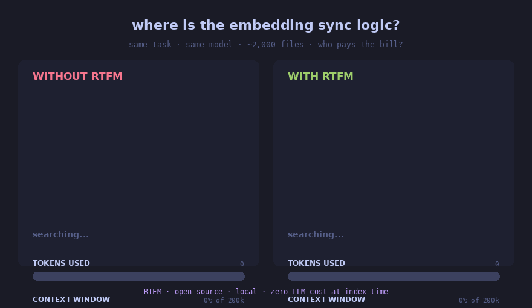

# RTFM

**The open retrieval layer your AI coding agent was missing.**

{ .center-img }


RTFM indexes your entire project — source code, documentation, legal text,
research papers, structured data — into one local SQLite knowledge base, and
serves surgical context to your AI agent over the [Model Context
Protocol](https://modelcontextprotocol.io/). Works with Claude Code, Cursor,
Codex, Claude Desktop, and any other MCP client.

It is **open source** (MIT), **runs entirely locally** (no cloud, no API
keys, no telemetry), and **extends to any file format** in ~50 lines of
Python or ~30 lines of YAML.

<div class="grid cards" markdown>

- :material-rocket-launch: **Quick start**

    ---

    Install and index your first project in two commands.

    [→ Quick start](#quick-start)

- :material-puzzle-edit: **Two levels of integration**

    ---

    Use 15 built-in parsers, or extend with declarative
    [JSON schema mappings](json-mappings.md) — no code required.

- :material-graph-outline: **Multi-domain**

    ---

    Indexes code (Python AST), docs (Markdown headers), legal (XML),
    research (LaTeX), tabular (CSV/XLSX), notebooks (Jupyter), databases (SQLite).

- :material-shield-check: **Privacy by default**

    ---

    One SQLite file in `.rtfm/`. No external services. Open it with
    `sqlite3` if you don't trust me.

</div>

## Why RTFM

AI coding agents are **blind without retrieval**. They grep through
thousands of files, lose context every session, hallucinate modules that
don't exist. The bottleneck isn't reasoning — it's **localization**:
finding the right files before writing code.

On a document-heavy task (French tax article generation, ~50 pages of
sourced regulatory text):

| Metric        | Without RTFM | With RTFM | Δ        |
|---------------|--------------|-----------|----------|
| Token cost    | $22.61       | $11.14    | **−51%** |
| Duration      | 8m16s        | 6m58s     | **−16%** |
| Tokens used   | 8.21M        | 3.22M     | **−61%** |

*[Full benchmarks →](benchmarks/ab_test_b10_analysis.md)*

## Quick start

The fastest path is the Claude Code plugin — zero pip required:

```
/plugin marketplace add roomi-fields/rtfm
/plugin install rtfm@rtfm
```

Then in your project:

```
rtfm init
```

That creates `.rtfm/library.db`, indexes the project, and registers RTFM
as an MCP server. Ask Claude Code anything that needs to find files; it
will search RTFM instead of running `grep` blindly.

For Cursor / Codex / Claude Desktop / other MCP clients, install via pip:

```bash
pip install rtfm-ai
cd your-project
rtfm init
```

## What RTFM is not

- **Not a vector database.** Default search is FTS5; embeddings are
  optional and local (FastEmbed/ONNX, no GPU required).
- **Not a hosted service.** Everything runs on your machine. No accounts,
  no API keys, no quotas.
- **Not a competing AI agent.** It's the retrieval layer *underneath*
  your agent of choice.
- **Not code-only.** Code indexers (Augment, Sourcegraph) ignore your
  PDFs, your LaTeX, your YAML configs. RTFM indexes everything.

## Where to next

<div class="grid cards" markdown>

- :material-target: **[Why RTFM](positioning.md)** — How RTFM compares to
  Augment, Sourcegraph, vector RAG, Karpathy's LLM Wiki pattern.

- :material-puzzle: **[Architecture](architecture.md)** — Internal layout,
  parser registry, sync, edges, embeddings.

- :material-format-list-bulleted: **[Built-in parsers](parsers.md)** — All
  15 formats with parsing strategies and chunk semantics.

- :material-code-json: **[JSON schema mappings](json-mappings.md)** — Map
  any JSON schema to typed chunks with declarative YAML.

- :material-notebook: **[NotebookLM integration](notebooklm-integration.md)**
  — Pair RTFM with `notebooklm-mcp` to break the 50 queries/day cap.

- :material-vault: **[Obsidian vault mode](obsidian-vault-guide.md)** —
  Karpathy's LLM Wiki, but searchable past 500 notes.

- :material-scale-balance: **[RTFM vs vector RAG](comparisons/vs-vector-rag.md)**
  — When FTS5 beats embeddings, and when both belong together.

- :material-history: **[Changelog](CHANGELOG.md)** — Release notes since
  v0.1.0.

</div>

<script type="application/ld+json">
{
  "@context": "https://schema.org",
  "@type": "SoftwareApplication",
  "name": "RTFM",
  "alternateName": "rtfm-ai",
  "description": "The open retrieval layer for AI coding agents. Indexes code, documentation, legal text, research papers, and data into a local SQLite knowledge base. Serves surgical context to Claude Code, Cursor, Codex, and other MCP clients.",
  "url": "https://roomi-fields.github.io/rtfm/",
  "applicationCategory": "DeveloperApplication",
  "applicationSubCategory": "Retrieval, Search, Indexing, MCP",
  "operatingSystem": "Linux, macOS, Windows",
  "softwareVersion": "0.7.0",
  "license": "https://opensource.org/licenses/MIT",
  "offers": {
    "@type": "Offer",
    "price": "0",
    "priceCurrency": "USD"
  },
  "downloadUrl": "https://pypi.org/project/rtfm-ai/",
  "codeRepository": "https://github.com/roomi-fields/rtfm",
  "programmingLanguage": "Python",
  "author": {
    "@type": "Person",
    "name": "roomi-fields",
    "url": "https://github.com/roomi-fields"
  },
  "keywords": "MCP, retrieval, RAG, FTS5, SQLite, embeddings, AI agent, Claude Code, Cursor, indexing, knowledge base, search, open source, multi-domain"
}
</script>
